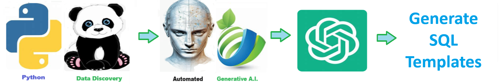

    
# Generate Sql 

## Generates SQL templates for Datasets

    

    

Welcome to the solution **Generate Sql** - an example for your projects

Generates SQL templates for Datasets

 

## Generate SQL

1. **Create Table**  
2. **SQL Select**  
3. **ETL Process**  

 

 
## Generate SQL

🔹 Generate SQL will generate various forms of SQL based upon the datas descriptive statistics:

1. ✅ **Create Table** → Adds a **table_name** for the table or dataset.
2. ✅ **SQL Select** → Adds a **column_name** for current column, how pandas named the raw data.
3. ✅ **ETL Process** → Adds a column for the **pandas.dtype**, how pandas inferred the raw data.

 

    

    
## Getting Started

The goal of this solution is to **Jump Start** your development and have you up and running in 30 minutes. 

To get started with the **Generate Sql** solution repository, follow these steps:
1. Clone the repository to your local machine.
2. Install the required dependencies listed at the top of the notebook.
3. Explore the example code provided in the repository and experiment.
4. Run the notebook and make it your own - **EASY !**
    
## Solution Features

- Easy to understand and use  
- Easily Configurable 
- Quickly start your project with pre-built templates
- Its Fast and Automated
- Saves You Time 

## ⚙️ Key Features

- ✅ **Self Documenting** Automatically identifies and annotates major steps in a notebook, making the codebase readable and well structured.
- ✅ **Self Testing** Includes built in **unit tests** for each function to validate logic and ensure code reliability.
- ✅ **Easily Configurable** Uses a simple **config.ini** file for centralized settings and easy customization through key value pairs.
- ✅ **Talking Code** explains itself through inline commentary, helping you understand both **what** it does and **why** it does it.
- ✅ **Self Logging** extends Python’s standard **logging** module for **step by step runtime insights**.
- ✅ **Self Debugging** Includes debugging hooks and detailed error tracing to simplify development and troubleshooting.
- ✅ **Low Code or  No Code** Designed to minimize complexity — most full solutions are under 50 lines of code.
- ✅ **Educational** Each template includes educational narrative and background context to support learning, teaching, and collaborative development.

    
## List of Figures
    
    

## Github https://github.com/JoeEberle/ - Email  josepheberle@outlook.com 
    

    